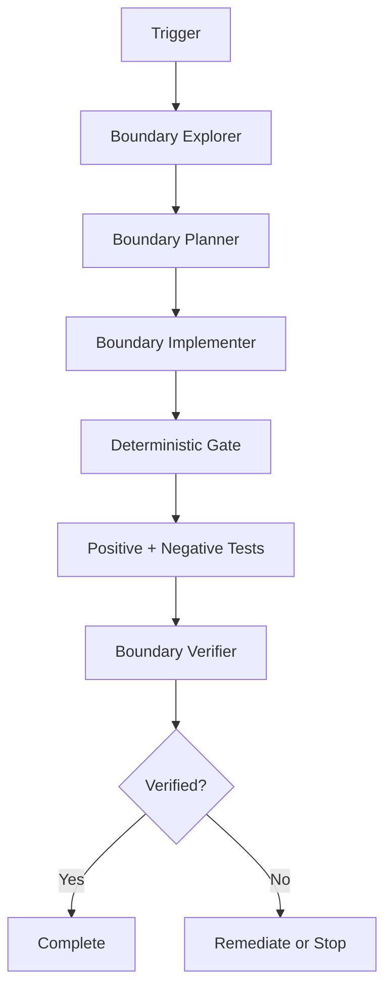

# Agent Multi-Tenant Data Boundary Gate

A reusable AI-engineering package for preventing accidental cross-tenant data access when coding agents implement or review multi-tenant applications.

## Problem

Multi-tenant defects often appear when a new query omits a tenant predicate, a write trusts a caller-supplied tenant ID, a global filter is bypassed, a background job loses tenant context, or a privileged code path quietly becomes cross-tenant. These failures are easy for coding agents to introduce because local code can appear functionally correct while violating an isolation boundary.

## Purpose

This package gives agents a repeatable workflow to discover tenant ownership, plan enforcement, implement the smallest safe change, run deterministic boundary checks, execute negative tests, and obtain independent verification before completion.

## When to use

Use for APIs, background jobs, repositories, EF Core/data-access changes, caches, queues, storage integrations, tenant-context refactors, authorization changes, and suspected tenant leakage.

## When not to use

Do not use this package as a substitute for application authorization design, database row-level security configuration, production incident authorization, or legal/compliance review. It must not be used to justify unapproved cross-tenant access.

## Architecture



## Package tree

```text
agent-multi-tenant-data-boundary-gate/
├── README.md
├── config/
│   └── policy.yaml
├── schemas/
│   └── boundary-result.schema.json
├── rules/
│   └── multi-tenant-safety.md
├── skills/
│   └── tenant-boundary-review.md
├── subagents/
│   ├── boundary-explorer.md
│   ├── boundary-planner.md
│   ├── boundary-implementer.md
│   └── boundary-verifier.md
├── workflows/
│   └── tenant-boundary-workflow.md
├── hooks/
│   └── lifecycle.md
├── scripts/
│   ├── tenant_boundary_gate.py
│   └── verify_package.py
├── templates/
│   └── operation-manifest.json
├── examples/
│   ├── safe-read.json
│   └── unsafe-write.json
└── tests/
    └── test_tenant_boundary_gate.py
```

## Component responsibilities

- `config/policy.yaml`: default tenant-context and cross-tenant policy.
- `rules/multi-tenant-safety.md`: enforceable MUST/MUST NOT/SHOULD rules.
- `skills/tenant-boundary-review.md`: reusable investigation and verification procedure.
- `subagents/`: separates exploration, planning, implementation, and verification ownership.
- `workflows/tenant-boundary-workflow.md`: bounded end-to-end execution model with retries, approvals, and stop conditions.
- `scripts/tenant_boundary_gate.py`: deterministic operation-manifest validator that blocks known unsafe boundary patterns.
- `schemas/boundary-result.schema.json`: structured result contract.
- `hooks/lifecycle.md`: pre-task, post-edit, test, and final verification hooks.
- `tests/test_tenant_boundary_gate.py`: regression tests for the deterministic gate.

## Installation

Copy this directory into the target repository or agent-instructions repository. Python 3.9+ is sufficient for the included scripts. `pytest` is required only to run the included tests.

No secrets or external services are required.

## Configuration

Edit `config/policy.yaml` to match the application's tenant identity sources and tenant-key conventions. A header should not be considered authoritative unless the surrounding infrastructure proves it was injected or attested by a trusted gateway.

For each affected operation, start from `templates/operation-manifest.json` and set fields using repository evidence rather than assumptions.

## Permissions

The normal workflow requires read access to the repository and permission to edit/test the target branch. It does not require production database access, permission elevation, deployment rights, secret access, or cross-tenant data privileges.

## Usage

Run the deterministic gate:

```bash
python scripts/tenant_boundary_gate.py examples/safe-read.json --output boundary-result.json
```

A safe operation exits `0`. A blocking finding exits `1`. Invalid input/tool failure exits `2`.

Run tests:

```bash
pytest -q tests/test_tenant_boundary_gate.py
```

Verify this package after copying or editing it:

```bash
python scripts/verify_package.py
```

## Example agent invocation

Ask the coding agent to follow `workflows/tenant-boundary-workflow.md` for the current feature, use `rules/multi-tenant-safety.md` as hard constraints, produce an operation manifest for each affected tenant-owned data path, and stop on an approval-required cross-tenant operation.

## Workflow

1. Boundary Explorer locates trusted tenant context and traces affected data paths.
2. Boundary Planner chooses minimal enforcement points and defines a test matrix.
3. Boundary Implementer applies the approved changes and writes regression tests.
4. The deterministic gate checks tenant-source trust, read scoping, write ownership, filter bypasses, and cross-tenant approval.
5. Targeted tests prove same-tenant access succeeds and cross-tenant access is denied.
6. Boundary Verifier independently checks the diff and evidence.
7. Completion occurs only when all blocking criteria pass.

## Approval boundaries

Explicit human approval is required before intentional cross-tenant reads/writes, disabling global query filters or row-level security, production data repair, destructive SQL/data operations, schema changes, privileged infrastructure/configuration changes, or any weakening of tenant-isolation controls.

The agent must stop before the dangerous action; approval cannot be inferred from task urgency or administrator credentials.

## Failure and recovery

Transient tool or CI failures may be retried once while preserving the original evidence. Test failures allow at most two evidence-driven fix/test cycles. Boundary blocks are not retryable without a concrete remediation. Permission failures must not be solved through silent privilege expansion. Unknown tenant ownership results in review/stop rather than guessing.

## Verification

A task is not verified merely because code was generated. Verification requires evidence that tenant context is trusted, affected reads are tenant-scoped, affected writes verify ownership, negative isolation tests pass, the deterministic gate is non-blocking, no unapproved bypass exists, and an independent verifier has reviewed the result.

## Definition of Done

- Required tenant context and ownership evidence was gathered.
- All affected tenant-scoped reads have verified isolation enforcement.
- All affected writes verify target ownership before mutation.
- Same-tenant positive tests pass.
- Cross-tenant negative tests pass.
- Deterministic gate results are passing for intended operations.
- No critical/high unresolved finding remains.
- Any intentional exception has explicit human approval and documented scope.
- Independent verification passes.
- Remaining non-blocking risks are documented.

## Customization

Extend the operation manifest and gate only for deterministic checks that can be supported by explicit evidence. Keep business-specific or framework-specific reasoning in separate adapters or repository instructions. For EF Core, SQL row-level security, Cosmos DB partition keys, cache key policies, or queue message envelopes, retain this package's core invariant: tenant authority must be trusted, and every tenant-owned resource access must be provably scoped.
