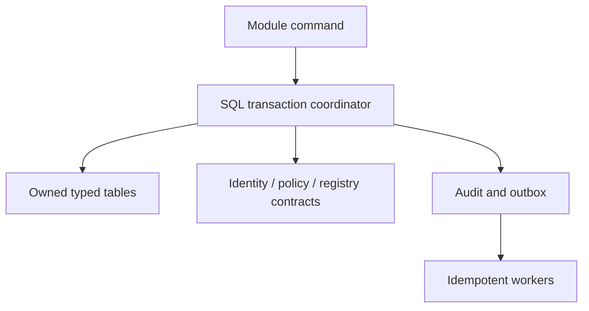

# M01 — database mapping and transaction design

SQL Server, EF Core contexts theo module, một database deployment ban đầu; không viết DDL/migration trong phase này. [Physical dictionary](../../design-database/02-core-identity-platform.md) là field/type source; contract bên dưới quy định aggregate boundary và batch sequence. Không tạo schema cho mọi module chỉ vì đã có bản vẽ.

## Table set được M01 sử dụng

| Tables | Purpose / authoritative fields | Story |
| --- | --- | --- |
| identity.User | Email/NormalizedEmail unique kể cả Deleted; PasswordHash, SecurityStamp, State, IsDeleted, DeletedAt/By, VerifiedAt/EmailConfirmed, DisplayName, TimeZoneId, Locale, RowVersion | S01..S08 |
| identity.Role, identity.UserRole | Fixed User/Admin/SuperAdmin; all accounts base User, at most one elevated role | S01,S08 |
| identity.Session | UserId, HandleHash, expiry/idle/recent-auth, RevokedAt, SecurityStamp | S03,S06 |
| identity.MfaCredential | Read guard for enabled factors; empty by default in M01, no enrollment mutation | S03,S04 |
| identity.OneTimeToken | UserId, purpose, TokenHash, EmailSnapshot, ExpiresAt, ConsumedAt | S02,S04 |
| identity.AccountMessageIntent | Pre-verification transactional delivery; không cần PersonalSpace trước verify | S02,S04,S10 |
| platform.PersonalSpace | UQ UserId; active exactly once after verification; identity remains after account delete | S01,S02 |
| platform.SecurityInvariant | Singleton LastActiveSuperAdmin serializes bootstrap/demotion/disable/delete | S01,S08 |
| platform.Module, ModuleRelease, ModuleDependency, ModuleMigration | Stable developer code/release/dependency/migration readiness; SystemEnabled/RegistrationEnabled/PolicyRevision/SharingEpoch | S02,S07,S09 |
| platform.UserModuleGrant | UserId/ModuleId effective grant snapshot; only actual installed capabilities | S02,S08 |
| platform.Permission, platform.AdminPermission | Stable action key + explicit Allow/Deny; no wildcard, Unset removes row | S07,S08 |
| security.AuditEvent | Actor/context/action/target/result/redacted diff; same transaction for security mutation | All mutations |
| identity.RequestReceipt | Anonymous/pre-space command retry ledger defined below; never a fake owner | S02,S04 |
| platform.ResourceType, platform.Resource, files.FileObject | Structural FK dependencies only; no Files CRUD or avatar upload | S00 |
| operations.SystemJob | Trusted maintenance dispatch sweep; no outbound ingestion enabled | S10 |
| operations.Idempotency, Outbox, InboxReceipt, Job, JobAttempt | Durable dedupe, event intent and retry; SQL source of truth | S02..S10 |
| notifications.Notification, Delivery, DeliveryAttempt, PushSubscription | One logical notification, independent three-channel outcomes; no subscription ≠ sent | S10 |

References: [security fields](../../design-database/03-security-sharing.md), [jobs/notifications fields](../../design-database/04-files-jobs-notifications.md). MfaCredential schema supports the confirmed TOTP method and its read-only authentication guard in M01; no enrollment operation or seeded credential. RecoveryCode remains a conditional future migration pending P-H01. An enabled-factor fixture must cause authentication to reject rather than ignore it; missing/unreadable factor state fails closed. AvatarFileId remains null in M01, but its referenced FileObject and Resource tables must exist. Nullable FK does not remove schema dependency; no Files CRUD is implied.

## Field reconciliation (current body, not an overlay)

User.State codes PendingVerification/Active/Disabled/Deleted; `State=Deleted ⇔ IsDeleted=true`; DeletedAt required iff deleted. User.Locale NOT NULL defaultvi, CHECK vi/en. Deleted email uniqueness unfiltered. No User purge path. PersonalSpace.State Active/Suspended; Deleted account retains its space with State=Suspended, not a purge queue. NormalizedEmail uniqueness checked again under transaction on credential change; no provider-specific email alias rewriting.

Module.SharingEpoch NOT NULL positive default1; no M01 user edit. SystemEnabled false does not rewrite UserModuleGrant/default. RegistrationEnabled is a snapshot policy, not current-user migration. Future executable modules arrive through trusted deployment; code/version/release rows immutable except through deployment transaction, never admin JSON upload.

## Atomic transactions

| Transaction | Lock/order | Atomic writes / failure outcome |
| --- | --- | --- |
| TX01 Bootstrap | Lock SecurityInvariant singleton before count; controlled operator execution | Verified User + base/elevated roles + space + audit; exactly one bootstrap winner; rollback all if any write fails |
| TX02 Register/verify | Register UQ email; verify conditional token consume + User row lock; module policy stable read | Register pending+proof+intent. Verify Active/EmailConfirmed/VerifiedAt + PersonalSpace + grants + audit/intents/idempotency result. SQL crash cannot leave Active without space or duplicate grants |
| TX03 Login/reauth/logout | SQL User state and stamp check, session compare/update | Login fresh handle hash; reauth only updates recent proof; logout revoke before clear cookie. No Redis-only authentication authority |
| TX04 Reset | Lock User + token; recheck state/MFA and single-use | New password hash/stamp, token consume, all session revocation, redacted audit+notification intent; failure rolls back, no auto-login |
| TX05 Profile | User RowVersion compare, allowed-field diff | Update only allowed fields + audit; locale change permission checked before write; all-or-nothing PATCH |
| TX06 Session revoke | Owner filter inside SQL; idempotent update | Revoke own target/all, audit/intent; no UserB identifier leakage |
| TX08 Access changes | SecurityInvariant before target User row when changing role; otherwise target User row; module policy locks in stable ModuleId order | Compare User.RowVersion/preview dependency revisions; validate all changes, mutate UserRole/grants, touch User.UpdatedAt/RowVersion, revoke affected authority, audit+outbox+idempotency. No partial batch |
| TX09 Module policy | Lock affected Module rows in stable ID order; validate dependencies and preview revisions | Bump PolicyRevision and RowVersion; mutate only requested flags; audit/outbox/idempotency. Reject disabling active hard dependency; no silent cascade. Pause scope checked from trusted release manifest |
| TX10 Delivery | Commit intent with source; worker SQL lease; dedupe receipt per logical intent/channel | External calls after SQL commit. Retry changes delivery status, never reruns source mutation. SQL intent failure rolls back protected source mutation |

### Read/revocation races

Every protected read checks current account/session/grants before query/projection. Mutation rechecks security authority inside commit transaction; no stale Allow cached in Redis. A read already authorized before revocation may finish, but no new read authorization or mutation commit may accept old authority after revocation commits. SQL locking tests must prove serialization; don't claim in-flight response bytes can be recalled. Clear UI caches on403/401; UI signal supplements server enforcement.

## Extension boundary

Module has its own DbContext/migrations and internal persistence. Core references are explicit; a domain module cannot query another module's tables directly. Cross-module orchestration uses contract participants with same SQL transaction only when atomicity required. New module registers manifest/actions/resources without switching on every FX in kernel. Shared JSON is versioned validated config/history, not universal EAV business schema.

## Migration and integrity gates after code approval

Order: common conventions → identity tables with cyclic FK constraints deferred → space/invariant and module/action catalog → ResourceType/Resource/FileObject → add and validate AvatarFileId and other deferred FK constraints → sessions/tokens/RequestReceipt → audit/outbox/jobs/notifications → fixture/registration defaults → bootstrap. No schema becomes Ready while a required FK is absent or untrusted. Self-reference User actor fields nullable for bootstrap; no cascading deletes. Migration journal locks one deployment; current target explicit; failed module never Ready. Test empty DB, previous candidate→new candidate, concurrent verify/UQ email, last SuperAdmin, stale grants, SQL rollback and worker retry. No live user data/keys required for these tests.

## Pre-space persistence and identity.RequestReceipt

Resolved technical decision. Anonymous register/verify/reset retries cannot use owner-scoped operations.Idempotency before a PersonalSpace exists. Use identity.RequestReceipt, a restricted identity table, with no PersonalSpace FK. Authenticated commands use operations.Idempotency under the authenticated actor’s space, not the target user’s space. Never invent an owner for pending registrations.

| Field | SQL type | Nullable | Constraint / meaning |
| --- | --- | --- | --- |
| Id | uniqueidentifier | No | PK, server generated |
| SubjectHash | binary(32) | No | Keyed digest of anonymous anti-forgery session binding; never email or raw cookie |
| OperationKey | nvarchar(150) | No | Trusted operation ID |
| KeyHash | binary(32) | No | Keyed digest of supplied idempotency UUID |
| RequestDigest | binary(32) | No | Keyed canonical request digest; no raw password/token |
| State | varchar(16) | No | Running, Succeeded, Failed |
| ResultCode | nvarchar(64) | Yes | Allowlisted replay outcome code; never a raw request secret |
| ResultStatusCode | int | Yes | Safe replay HTTP status for an explicitly allowlisted local projection |
| ResultJson | nvarchar(max) | Yes | Optional safe response projection only; JSON, size-bounded by the owning slice, never password/token/secret/raw source payload |
| CreatedAt | datetime2(7) | No | UTC server timestamp |
| ExpiresAt | datetime2(7) | No | CreatedAt + 24 hours |
| RowVersion | rowversion | No | SQL generated |

UQ(SubjectHash,OperationKey,KeyHash); index ExpiresAt. Same key/different RequestDigest rejects. Receipt and successful source writes commit atomically; no success record survives rollback. Duplicate waits for transaction completion then returns the same safe outcome/projection after current token/account/operation guards. Sensitive operations remain generic and never persist a response body. All fields Restricted system, hashes Secret-derived; excluded from sharing, support, search, logs and export. Expiry cleanup is maintenance, not user-data purge.

Migration `20260910_0017_favorites_refs.sql` adds `ResultStatusCode` and
`ResultJson` for the local Favorites slice. Only an explicitly safe
`FavoriteRecord` projection (or a 204 marker) may be written; callers must not
store arbitrary response bodies. A replay rechecks the current operation and
source capability/lifecycle before returning a projection. If the source is no
longer readable, the replay is redacted to the same unavailable shape; if the
favorite itself no longer exists, the service returns a safe replay-unavailable
conflict. This keeps idempotency from becoming a stale metadata or authority
escape hatch.

AccountMessageIntent is itself the pre-activation outbox: source transaction writes it directly; a leased SystemJob maintenance sweep selects pending intents with SQL locking and sends outside the source transaction. SystemJob arguments contain only the fixed sweep name/range, never account secrets or recipient data. Delivery failures update the intent and schedule bounded retry; duplicated external email remains possible after ambiguous provider acknowledgement. Owner-scoped Outbox/Job/Notification rows are written only once a real PersonalSpace exists. System policy changes enqueue a trusted maintenance sweep in the same transaction; per-user notification fan-out creates owner-scoped intents idempotently afterwards.
